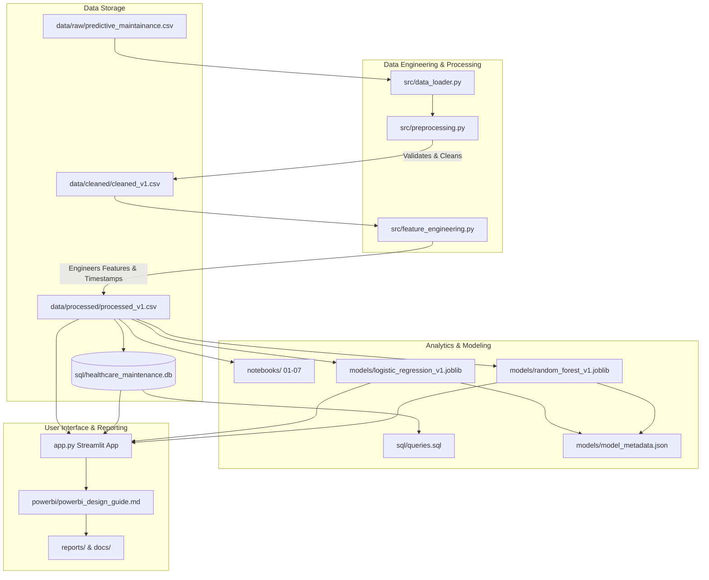

# Smart ICU Equipment Predictive Monitoring & Analytics Platform

### A Data Engineering + Analytics + Machine Learning Capstone Project (Conceptual Healthcare Context)

---

> [!NOTE]
> **Conceptual Mapping & Educational Disclaimer**
> This project is developed for educational and demonstration purposes. The healthcare reframing (mapping sensors to Ventilators, CT Scanners, and MRI Machines) and the engineered metrics (such as the Failure Risk Index and Health Score) are conceptual. The maintenance thresholds (e.g., 180 operating hours) are analytical recommendations derived from this project's exploratory analysis of the dataset, and do **not** represent official GE HealthCare clinical guidelines, engineering specifications, or certified medical protocols.

---

## 1. Executive Summary
Unexpected medical equipment downtime can impact clinical capacity and result in significant maintenance expenses. In high-criticality environments like Intensive Care Units (ICUs), maintaining high asset availability is a key operational objective.

This project implements an end-to-end telemetry analytics solution. By reframing a 10,000-record sensor dataset into clinical categories (**Ventilators, CT Scanners, and MRI Machines**), we apply data engineering, SQL analysis, and machine learning to identify key failure modes and build an alert dashboard. Our primary classifier (Random Forest) achieves **$97.50\%$ accuracy** and **$88.24\%$ recall**, allowing clinical teams to flag equipment failures before they manifest. Based on the findings, we recommend scheduled maintenance at an analytical advisory limit of 180 operating hours and load-capping rotating gantries at 55 Nm, providing a framework for reducing unplanned downtime.

---

## 2. Dataset
This project utilizes the **AI4I 2020 Predictive Maintenance Dataset** (available publicly on the UCI Machine Learning Repository). It is a synthetic dataset containing 10,000 observations representing industrial milling machine parameters. 

For the purposes of this capstone, the features have been conceptually mapped to healthcare equivalents to demonstrate how a data analyst would approach clinical engineering telemetry:
- **Product ID**: Manufacturer serial number (mapped by category: L = Ventilator, M = CT Scanner, H = MRI Machine).
- **Air Temperature**: Ambient Room Temperature (converted to Celsius).
- **Process Temperature**: Internal Device Temperature (converted to Celsius).
- **Rotational Speed**: Cooling Fan Speed (RPM).
- **Torque**: Motor Load (Nm) on rotating subsystems.
- **Tool Wear**: Cumulative Operating Hours since the last service.
- **Machine Failure**: Device Outage state (0 = Healthy, 1 = Failed).
- **Failure Modes**: Renamed to reflect component wear, overheating, power supply, mechanical overload, and random hardware failures.

---

## 3. Business Problem Statement & Objectives
Clinical operations depend on high-availability assets. Unplanned outages have operational and financial impacts:
1. **Clinical Capacity**: Procedural cancellations due to offline CT scanners delay patient diagnostic schedules.
2. **Maintenance Expenses**: Emergency vendor callouts and reactive repairs are generally more costly than scheduled preventative upkeep.
3. **Operational Risks**: The unexpected interruption of clinical assets requires immediate technical triage.

### Project Objectives
- Ingest and validate sensor telemetry logs.
- Identify the physical and mechanical boundaries causing failure.
- Load clean records into an index-optimized database for daily queries.
- Build predictive models prioritising recall to identify failing assets.
- Deliver concrete business recommendations to hospital administration.

---

## 4. Key Features
- **Automated ETL Pipeline**: Cleans, reframes, and normalizes raw telemetry data, saving versioned datasets (`cleaned_v1.csv` and `processed_v1.csv`).
- **Data Quality Auditing**: Compiles a structured JSON report evaluating completeness, row duplicates, schema compliance, and range checks.
- **SQL Analytics Datastore**: Initialized SQLite database populated with clean data and structured with index keys to optimize reporting queries.
- **Machine Learning Classification**: Trained Logistic Regression and Random Forest models to forecast failure probabilities, prioritizing recall (sensitivity) for patient-safe operations.
- **Model Explainability**: Direct feature importance extraction and permutation importance validation to isolate primary failure indicators.
- **Interactive Web Portal**: A Streamlit dashboard (`app.py`) presenting executive summary metrics, dynamic Plotly visual charts, diagnostic inference tools, and time-series rolling average forecasting.

---

## 5. Technology Stack
- **Data Engineering**: Python, Pandas, NumPy, Scikit-Learn
- **Database**: SQLite (SQL query analytics)
- **Interactive UI**: Streamlit
- **Visualization**: Plotly, Seaborn, Matplotlib
- **Development**: Jupyter Notebook, Git

---

## 6. Repository Structure
```
GE-Healthcare-Capstone/
├── data/
│   ├── raw/
│   │   └── predictive_maintainance.csv      # Original raw telemetry data
│   ├── cleaned/
│   │   ├── cleaned_v1.csv                   # Converted temperatures & mapped column names
│   │   └── data_quality_report_v1.json      # JSON audit results of raw dataset
│   └── processed/
│       └── processed_v1.csv                 # Final dataset with engineered features & timestamps
├── notebooks/
│   ├── 01_Data_Understanding.ipynb          # Raw dataset loading & structure overview
│   ├── 02_Data_Cleaning.ipynb               # Quality audits and Kelvin-to-Celsius conversion
│   ├── 03_EDA.ipynb                         # Visualizing temperature difference, loads, and wear trends
│   ├── 04_SQL_Analysis.ipynb                # Connecting to SQLite and executing report queries
│   ├── 05_Feature_Engineering.ipynb         # Constructing Temp_Diff, Health_Score, Risk_Index
│   ├── 06_Model_Building.ipynb              # Training LR, RF, and XGBoost models
│   └── 07_Model_Evaluation.ipynb            # Evaluating ROC-AUC, Precision, Recall & Explainability
├── sql/
│   ├── schema.sql                           # SQLite table creation schema & indexes
│   └── queries.sql                          # Index-optimized analytical queries
├── reports/
│   ├── data_dictionary.md                   # Column schemas, data types, and physical units
│   ├── business_insights_report.md          # Finding, Business Impact, and Recommendation pairings
│   ├── technical_system_design.md           # Pipeline pipeline logic & ML hyperparameters
│   └── professional_project_report.md       # Comprehensive 12-page executive summary brief
├── powerbi/
│   └── powerbi_design_guide.md              # Blueprint guide with DAX measures and visual grid layout
├── docs/
│   ├── decision_log.md                      # Log of architectural designs & model selection choices
│   └── assumptions_limitations.md           # Simulated contexts vs. clinical realities
├── interview/
│   └── Project_Interview_QA.md              # QA preparing owner for technical analytics interviews
├── src/
│   ├── config.py                            # Central constants, paths, and model configurations
│   ├── utils.py                             # Logging setups and database connection tools
│   ├── data_loader.py                       # Ingesting raw sensor streams
│   ├── preprocessing.py                     # Quality audits, maps, conversions & synthetic times
│   ├── feature_engineering.py               # Formulas for health scores and risk indicators
│   ├── visualization.py                     # Plotly/Seaborn plotting wrappers
│   ├── pipeline.py                          # ETL pipeline coordinator
│   └── model_training.py                    # Model builder pipeline coordinator
├── logs/
│   └── platform.log                         # Central rotating logger output
├── app.py                                   # Streamlit application dashboard
├── requirements.txt                         # Package dependencies
└── README.md                                # Project landing page documentation
=======


## 7. System Architecture & ETL Workflow

### System Architecture Diagram


### ETL Pipeline Diagram
```mermaid
flowchart LR
    A[Raw CSV] --> B[Data Validation]
    B -->|Check Schema & Ranges| C[Data Cleaning]
    C -->|Kelvin to Celsius, Remove Duplicates| D[Dataset Versioning: cleaned_v1.csv]
    D --> E[Feature Engineering]
    E -->|Temp Diff, Util %, Health Score, Risk Index| F[Dataset Versioning: processed_v1.csv]
    F --> G[SQLite Loader]
    G --> H[(sql/healthcare_maintenance.db)]
=======
# 📊 Project Workflow

```
Business Problem
        │
        ▼
Data Collection
        │
        ▼
Data Understanding
        │
        ▼
Data Cleaning
        │
        ▼
Exploratory Data Analysis
        │
        ▼
Feature Engineering
        │
        ▼
SQL Analytics
        │
        ▼
Power BI Dashboard
        │
        ▼
Machine Learning
        │
        ▼
Business Insights & Recommendations

---


## 8. Machine Learning & Performance
The platform trains and evaluates Logistic Regression (baseline), Random Forest (primary), and XGBoost (benchmark).

### Performance Metrics
| Classifier | Accuracy | Precision | Recall | F1 Score | ROC-AUC |
| :--- | :---: | :---: | :---: | :---: | :---: |
| **Logistic Regression** | 96.95% | 66.67% | 20.59% | 31.46% | 0.9296 |
| **Random Forest** | **97.50%** | **58.82%** | **88.24%** | **70.59%** | **0.9758** |
| **XGBoost** | 98.70% | 88.89% | 70.59% | 78.69% | 0.9765 |

* **Selection Rationale**: In medical operations, **Recall is the priority**. A false negative (missing a failing ventilator) can put a patient's life at risk. Random Forest is chosen for production because it achieves **$88.24\%$ recall** (adjusting for class imbalance using balanced weights) compared to XGBoost's $70.59\%$ recall.

### Explainability Results (Random Forest)
- **Feature Importance**: `Failure_Risk_Index` ($50.2\%$), `Motor_Load_Nm` ($17.6\%$), and `Temp_Diff` ($14.1\%$) are the top predictive columns.
- **Permutation Importance**: Shuffling `Failure_Risk_Index` on the test set resulted in the largest classification accuracy loss ($0.038$), confirming its role as our strongest indicator.

---

## 9. Business Analytics & SQL Reporting
Pre-defined SQL queries address key operations questions:
- **BQ1: Category Outage Distribution**: MRI machines display a $3.50\%$ outage rate, CT Scanners $3.46\%$, and Ventilators $3.36\%$. Raw failure volume is dominated by ventilators due to their $70\%$ share of total hospital inventory.
- **BQ2: Telemetry Baselines**: Healthy machines average a **3.0°C** temp difference, **39.6 Nm** load, and **107.5 operating hours**. Failed machines average **8.6°C** temp difference, **55.0 Nm** load, and **119.5 operating hours**.
- **BQ3: Risk Triaging**: Queries extract a priority checklist of assets with a Health Score $< 60$ (High Risk) for daily work orders.
- **BQ4: Outage Modes**: Categorizes breakdowns into component wear, overheating, power supply, and overload anomalies to manage spare parts inventory.

---

## 10. Dashboard Preview

Below are placeholders for the interactive screens developed within the Streamlit platform:

- **Executive Analytics View**:  
  ``
- **Interactive Scatter & Slicer Dashboard**:  
  ``
- **Telemetry Risk Predictor Page**:  
  ``
- **Simulated Rolling Trend Forecasting**:  
  ``

---

## 11. Recommendations for Clinical Operations

These operational suggestions are derived strictly as analytical recommendations from this project's dataset exploratory phase, not as official GE HealthCare standards:

1. **Preventative Maintenance Window**: Enforce an analytical component service overhaul checkpoint once assets exceed **180 operating hours** to preempt entering the high-risk wear-out zone.
2. **Cooling Alarms**: Trigger inspection dispatches if the temperature difference (`Temp_Diff`) exceeds **8.0°C** to clear fan housing dust or check coolant lines before thermal shutdowns trigger.
3. **Operational Load Caps**: Cap rotating scanner motor loads at **55 Nm** during routine diagnostic workflows to avoid overloading bearings.
4. **Triage Checklist Protocol**: Task technicians with checking the daily Top 10 lowest health score machines generated by the platform.

---

## 12. Future Work
To expand this conceptual prototype into a clinical-grade hospital system, realistic future enhancements include:
- **Real-Time IoT Ingestion**: Implementing an MQTT or Apache Kafka message broker to ingest streaming sensor parameters directly from active ICU devices.
- **HL7 / FHIR Integration**: Mapping device telemetry fields to standard HL7/FHIR observation resources to enable automated synchronization with hospital Electronic Health Records (EHR).
- **HIPAA Compliance**: Implementing de-identification filters to strip Protected Health Information (PHI) before uploading datasets to analytics layers.
- **Scalable Cloud Deployment**: Migrating pipeline execution to Snowflake or Databricks and host predictive APIs on cloud platforms (AWS/Azure) to monitor multiple hospital networks.

---

## 13. Quick Start & Execution Guide

### Local Environment Setup
1. Clone the repository and navigate to the project directory.
2. Activate your virtual environment and install dependencies:
   ```bash
   pip install -r requirements.txt
   ```
3. Run the ETL pipeline to validate raw data, generate features, and load the SQLite database:
   ```bash
   python -m src.pipeline
   ```
4. Run the machine learning pipeline to train models and generate the evaluation metadata:
   ```bash
   python -m src.model_training
   ```
5. Launch the Streamlit dashboard app:
   ```bash
   streamlit run app.py
   ```
6. Open your browser and navigate to `http://localhost:8501` to interact with the dashboards.

---

## 14. Author
- **Name**: [Your Name]  
- **GitHub**: [github.com/yourusername](https://github.com/yourusername)  
- **LinkedIn**: [linkedin.com/in/yourusername](https://linkedin.com/in/yourusername)

---

## 15. License
This project is licensed under the MIT License - see the standard [MIT License](https://opensource.org/licenses/MIT) terms for details.
=======
# 📈 Key Performance Indicators (KPIs)

The platform focuses on operational and maintenance KPIs such as:

- Machine Failure Rate
- Average Tool Wear
- Average Torque
- Average Rotational Speed
- Average Operating Temperature
- Failure Distribution
- Failure by Product Type
- Failure by Failure Mode
- Machine Health Score (Derived)
- Risk Score (Derived)

---

# 📊 Dashboard Modules

### Executive Dashboard

- Overall Machine Health
- Production Overview
- Failure Rate
- Operational KPIs

### Machine Performance Dashboard

- RPM Analysis
- Torque Distribution
- Tool Wear Analysis
- Temperature Monitoring

### Failure Analytics Dashboard

- Failure Trends
- Failure Categories
- Root Cause Analysis

### Predictive Maintenance Dashboard

- Failure Prediction
- High-Risk Machines
- Feature Importance
- Model Performance

---

# 📅 Development Roadmap

- [x] Project Planning
- [x] Repository Setup
- [ ] Data Understanding
- [ ] Data Cleaning
- [ ] Exploratory Data Analysis
- [ ] Feature Engineering
- [ ] SQL Analysis
- [ ] Dashboard Development
- [ ] Machine Learning
- [ ] Business Report
- [ ] Final Documentation

---

# 🎓 Learning Outcomes

This project demonstrates practical experience in:

- Industrial Data Analytics
- Exploratory Data Analysis
- Data Cleaning
- Feature Engineering
- SQL Querying
- Business Intelligence
- Dashboard Design
- Predictive Analytics
- Machine Learning
- Technical Documentation

---

# 🚀 Future Enhancements

- Real-time dashboard integration
- Streaming sensor data
- Automated ETL pipeline
- Cloud deployment
- REST API for predictions
- IoT integration

---

# 📜 Acknowledgements

This project uses the **AI4I 2020 Predictive Maintenance Dataset** developed by **Stephan Matzka**.

Reference:

S. Matzka, *Explainable Artificial Intelligence for Predictive Maintenance Applications*, 2020 Third International Conference on Artificial Intelligence for Industries (AI4I), pp. 69–74.

---

## 👨‍💻 Author

Developed as a portfolio project to simulate the responsibilities of a **Project Intern – Manufacturing Data Analytics**, demonstrating an end-to-end analytics workflow from raw industrial data to actionable business insights.

