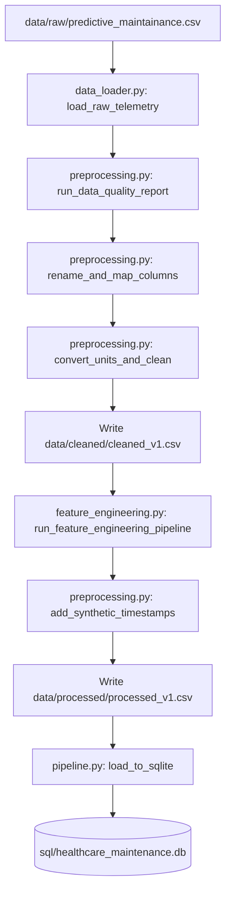

# Technical System Design Report - Smart ICU Equipment Monitoring Platform

This report details the system architecture, ETL pipeline, data quality rules, and machine learning specifications.

---

## 1. ETL Pipeline Specification

The ETL pipeline processes raw telemetry data and loads it into an analytical SQLite database.



### A. Data Quality Validation Rules
Before transformation, raw data is evaluated using the following criteria in `preprocessing.py`:
1. **Schema Check**: Confirm expected columns (UDI, Type, temperatures, torque, speed, wear, failure) exist.
2. **Completeness Audit**: Calculate the missing percentage per column (threshold: $100\%$ completeness expected).
3. **Uniqueness Audit**: Check for duplicate rows and duplicate `Product ID` entries.
4. **Range Validations**:
   - Ambient Air Temp: $290\text{ K} \le T_{\text{air}} \le 310\text{ K}$
   - Internal Device Temp: $300\text{ K} \le T_{\text{device}} \le 320\text{ K}$
   - Cooling Fan Speed: $1000 \le \text{RPM} \le 3000$
   - Motor Load: $0 \le \text{Torque} \le 100\text{ Nm}$
   - Operating Hours: $0 \le \text{Hours} \le 300$
5. **Consistency Audit**: Verify that if any individual failure mode flag (`TWF`, `HDF`, `PWF`, `OSF`, `RNF`) is $1$, the target variable `Machine failure` is also $1$. Flag cases where they mismatch.

---

## 2. SQLite Database Schema & Indexing

The database is built at `sql/healthcare_maintenance.db` using table `icu_equipment`. 

### Indexing Rationale
To ensure fast dashboard load times and query performance:
- `idx_equipment_category`: Speeds up category aggregations (e.g. BQ1 and BQ4).
- `idx_device_failure`: Optimizes filtering on failed vs. healthy machines.
- `idx_maintenance_risk`: Speeds up queries retrieving prioritized maintenance checklists (e.g. BQ3).
- `idx_product_id`: Optimizes lookups for individual device history.

---

## 3. Machine Learning Specifications

### Feature Matrix
- **Numerical Features**: `Ambient_Room_Temp_C`, `Internal_Device_Temp_C`, `Cooling_Fan_Speed_RPM`, `Motor_Load_Nm`, `Operating_Hours`, `Temp_Diff`, `Utilization_Pct`, `Failure_Risk_Index`.
- **Target**: `Device_Failure` (Binary classification).

### Model Hyperparameters & Versioning
All models are saved in the `models/` directory using joblib serialization with versioning:
1. **Logistic Regression (`logisticregression_v1.joblib`)**:
   - `solver`: `liblinear`
   - `C`: `1.0` (Standard L2 regularization)
   - `max_iter`: `1000`
2. **Random Forest (`randomforest_v1.joblib`)**:
   - `n_estimators`: `100`
   - `max_depth`: `10` (Controlled to prevent overfitting)
   - `class_weight`: `balanced` (Adjusts for the severe $3.39\%$ class imbalance)
3. **XGBoost (`xgboost_v1.joblib`)**:
   - `n_estimators`: `100`
   - `max_depth`: `5`
   - `learning_rate`: `0.1`

### Centralized Logging Configuration
The system records all operational steps using Python's `logging` module to a rotating log file `logs/platform.log` and the standard output stream. The log pattern includes `[timestamp] [levelname] [filename:line_number] - [message]`.
```python
# Setup rotating log handler inside utils.py
file_handler = RotatingFileHandler(
    LOG_FILE_PATH, maxBytes=10*1024*1024, backupCount=5, encoding="utf-8"
)
```
This logs pipeline progress, model accuracy scores, query counts, and database insertions.
